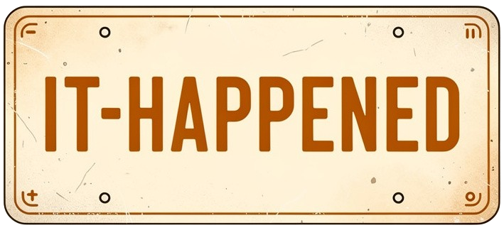

# it-happened

A library that simplify event-driven development.

<figure markdown="span">
  
</figure>

## Requirements

- Go 1.25 or higher

## Installation

```bash
go get github.com/thomas-marquis/it-happened
```

## Features

**Basic features:**

TODO

**What makes a difference:**

TODO

## Getting Started

TODO

## Basic Usage

TODO

## Examples

You can find more detailed examples in the `examples` folder.

TODO

## Useful Links

TODO